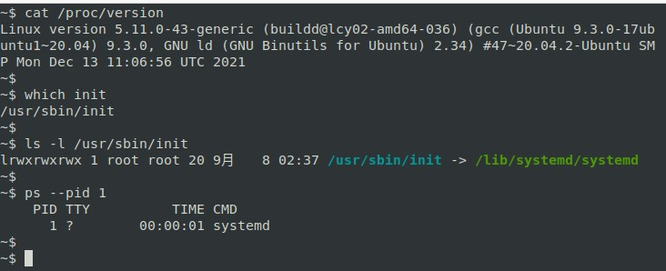

* [00\_系统初始化](#00_系统初始化)
    * [init 初始化系统简介](#init-初始化系统简介)
      * [BusyBox init](#busybox-init)
      * [OpenWrt init](#openwrt-init)

## 00_系统初始化

Linux 系统无法自我启动，需要依靠其他的程序来引导启动，在 PC 和服务器上的系统发行版中，引导启动流程如下图所示：

> [*The 20,000-foot view of the Linux boot process*](https://developer.ibm.com/articles/l-linuxboot/)

在嵌入式 Linux 系统中，流程如下图所示：

> [*Overview of boot process*](https://www.embeddedartists.com/wp-content/uploads/2019/03/iMX_Working_with_Linux_and_uboot.pdf/)

可见，无论在何种平台上，引导启动流程最终都会运行一个名为 [init](https://baike.baidu.com/item/init%E8%BF%9B%E7%A8%8B/3042859) 的进程，该进程的实体及其相关的规则也称为初始化系统：[init system](https://wiki.gentoo.org/wiki/Init_system)；该进程是 Linux 系统启动的第一个进程，其进程 ID 为 1，负责创建系统所需的所有其他进程和守护进程，是系统中所有其他进程的「祖先」，在系统关机时该进程还负责回收所有的系统资源。

### init 初始化系统简介

Linux init 初始化系统有不同的版本，常见的如：[sysvinit](https://savannah.nongnu.org/projects/sysvinit)、[systemd](https://systemd.io/)、[openRC](https://wiki.gentoo.org/wiki/OpenRC)、[runit](http://smarden.org/runit/)等，其对比可参考该 [链接](https://wiki.gentoo.org/wiki/Comparison_of_init_systems)；其中 sysvinit 是 SysV 风格的初始化程序集合，是一个经典的初始化系统，systemd 是其 [替代版本](https://www.freedesktop.org/wiki/Software/systemd/)，并且支持 SysV 和 [LSB init](https://refspecs.linuxfoundation.org/LSB_5.0.0/LSB-Core-generic/LSB-Core-generic/tocsysinit.html) 脚本，当前 PC 和服务器发行版大部分使用的是 systemd，例如Ubuntu：

但是嵌入式 Linux 系统并不常用 systemd，因嵌入式设备性能有限，其使用的通常是BusyBox、OpenWrt等开源软件自带的初始化系统，以下分别进行介绍。

#### BusyBox init

[BusyBox](https://baike.baidu.com/item/busybox) 是一个集成了三百多个最常用 Linux 命令和工具的软件，其中包括了init初始化系统；

#### OpenWrt init

[OpenWrt](https://openwrt.org/) 是一个面向嵌入式设备的 Linux 操作系统，最初是针对路由器设备，拥有强大的网络组件和扩展性，具有良好的模块化和可定制性，现在也常用做其他嵌入式设备的 Linux 发行版；

