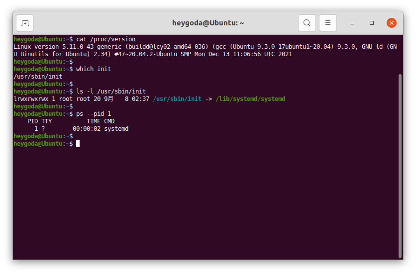
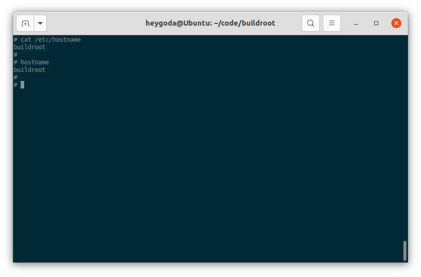

* [00\_系统初始化](#00_系统初始化)
    * [init 初始化系统简介](#init-初始化系统简介)
      * [BusyBox init](#busybox-init)
      * [sysvinit](#sysvinit)
      * [OpenWrt procd](#openwrt-procd)
      * [systemd](#systemd)

## 00_系统初始化

Linux 系统无法自我启动，需要依靠其他的程序来引导启动，在桌面和服务器发行版中，引导启动流程如图所示：[*The 20,000-foot view of the Linux boot process*](https://developer.ibm.com/articles/l-linuxboot/)

<div align=center></div>

在嵌入式 Linux 系统中，流程如图所示：[*Overview of boot process*](https://www.embeddedartists.com/wp-content/uploads/2019/03/iMX_Working_with_Linux_and_uboot.pdf)

<div align=center></div>

可见，无论在何种平台上，引导启动流程最终都会运行一个名为 [init](https://baike.baidu.com/item/init%E8%BF%9B%E7%A8%8B/3042859) 的进程，在系统中的文件为 `/sbin/init`，该进程的实体及其相关的规则也称为初始化系统：[init system](https://wiki.gentoo.org/wiki/Init_system)；该进程是 Linux 系统启动的第一个进程，其进程 ID 为 1，负责创建系统所需的所有其它进程和守护进程，是系统中所有其它进程的「祖先」，在系统关机时该进程还负责回收所有的系统资源。

### init 初始化系统简介

Linux init 初始化系统有不同的版本，如：sysvinit、systemd、openRC、runit等，点击 [这里](https://wiki.gentoo.org/wiki/Comparison_of_init_systems) 了解其差异性；

- [sysvinit](https://savannah.nongnu.org/projects/sysvinit) 是 System V 风格的初始化程序集合，是一个经典的初始化系统；
- [systemd](https://systemd.io/) 是sysvinit的 [替代版本](https://www.freedesktop.org/wiki/Software/systemd/)，并且支持 System V 和 [LSB init](https://refspecs.linuxfoundation.org/LSB_5.0.0/LSB-Core-generic/LSB-Core-generic/tocsysinit.html) 脚本，常见于桌面和服务器 Linux 发行版，如 Ubuntu：

<div align=center></div>

- [openRC](https://wiki.gentoo.org/wiki/OpenRC) 是 [Gentoo](https://www.gentoo.org/) 发行版的原生初始化系统，是一个基于依赖的初始化系统，用于类 Unix 系统；支持在启动时以正确的顺序启动必要的系统服务，在系统使用时管理它们，在关闭时停止它们；
- [runit](http://smarden.org/runit) 是一个跨平台的 Unix 初始化系统，可用于替换 sysvinit，具有服务监控、可靠的日志记录工具等特点；

嵌入式 Linux 中常用的初始化系统有BusyBox init、sysvinit 和 OpenWrt procd 等，systemd 因占用资源较多，不常用于嵌入式设备；

#### BusyBox init

[BusyBox](https://baike.baidu.com/item/busybox) 是一个组合了许多常见 Unix 实用程序精简版的软件，其中包括一个 `init` 程序，如图：

<div align=center></div>

该 init 程序有一个默认的配置文件 `/etc/inittab`，该文件包含了一系列规则，以便在系统启动或关机时执行相应的程序；BusyBox 源码中有该文件的示例和解释 [inittab « examples - busybox](https://git.busybox.net/busybox/tree/examples/inittab?h=1_23_1&id=1ecfe811fe2f70380170ef7d820e8150054e88ca)：

- 规则格式：

  ```shell
  <id>::<action>:<program>
  ```

  每条规则包含 3 个字段id、action 和 program，每两个字段间用 `:` 隔开（注意 id 和 action 之间有一个被忽略的空字段），每条规则单独占用一行；

- 各字段含义如下：

| 字段    | 含义                                                         |
| :------ | ------------------------------------------------------------ |
| id      | 指定执行程序的终端，该字段内容会被附加到 `/dev/` 再使用，例如该字段为 `ttyS0`，则最终为 `/dev/ttyS0`；如果为空，则使用 `init` 缺省的 `stdin/out`； |
| action  | 指定执行程序的条件，有效的条件为：sysinit, wait, once, respawn, askfirst, shutdown, restart, ctrlaltdel，具体含义见下表； |
| program | 程序及其参数                                                 |

- action 字段条件含义如下：


| action     | 含义                                                         |
| ---------- | ------------------------------------------------------------ |
| sysinit    | 该条件优先级高于其他所有条件，系统启动后首先执行的程序应该使用此条件，该条件下 `init` 等待程序执行完成后再执行下一条； |
| wait       | 在 sysinit 后执行，该条件下 `init` 等待程序执行完成后再执行下一条； |
| once       | 在 wait 后执行，该条件下 `init` 不等待程序执行完就开始执行下一条； |
| respawn    | 接着 once 后执行，该条件下执行程序并在程序退出时重新执行它，常用于执行守护进程； |
| askfirst   | 接着 once 后执行，功能与 respawn 类似，但在运行程序前 `init` 会提示 "Please press Enter to activate this console"，等待用户按下「回车键」之后，才开始执行程序，常用于在终端启动一个不需要登录用户名和密码的交互式 shell； |
| shutdown   | 系统「暂停/重启/关机」（ `halt/reboot/poweroff` ）或 `init` 接收到 `SIGQUIT` 信号时执行， |
| restart    | `init` 接收到 `SIGQUIT` 信号（键盘上同时按下 `Ctrl-\\` ）时执行，表示需要重新加载 `/etc/inittab` 配置文件，如果没有定义 restart 条件，则 `SIGQUIT` 信号不起作用； |
| ctrlaltdel | `init` 接收到 `SIGINT` 信号（键盘上同时按下 `Ctrl-Alt-Del` ）时执行，执行完后，askfirst / respawn 的执行流程会被挂起； |

- 如果没有定义 `/etc/inittab` 配置文件，BusyBox init 会使用以下默认规则：

  ```shell
  ::sysinit:/etc/init.d/rcS
  ::askfirst:/bin/sh
  ::ctrlaltdel:/sbin/reboot
  ::shutdown:/sbin/swapoff -a
  ::shutdown:/bin/umount -a -r
  ::restart:/sbin/init
  tty2::askfirst:/bin/sh
  tty3::askfirst:/bin/sh
  tty4::askfirst:/bin/sh
  ```

  1. 系统启动时，首先执行程序 `/etc/init.d/rcS`；
  2. 然后在 `init` 缺省的 `stdin/out` 和 `/dev/tty2, /dev/tty3, /dev/tty4` 中启动 shell: `/bin/sh`；
  3. 系统关机时，执行 `/sbin/swapoff -a` 和 `/bin/umount -a -r`，即关闭系统交换分区和卸载所有文件系统；
  4. 当键盘上同时按下 `Ctrl-Alt-Del` 时，执行 `/sbin/reboot`，即重启系统；
  5. 当 `init` 接收到 `SIGQUIT` 信号时，执行 `/sbin/init`，即重新加载 `/etc/inittab`；
  
- 下面是一个来自 [Buildroot](https://buildroot.org/) （一个嵌入式Linux系统构建工具）的通用配置文件：

  ```shell
  # /etc/inittab
  
  # Startup the system
  ::sysinit:/bin/mount -t proc proc /proc
  ::sysinit:/bin/mount -o remount,rw /
  ::sysinit:/bin/mkdir -p /dev/pts /dev/shm
  ::sysinit:/bin/mount -a
  ::sysinit:/sbin/swapon -a
  null::sysinit:/bin/ln -sf /proc/self/fd /dev/fd
  null::sysinit:/bin/ln -sf /proc/self/fd/0 /dev/stdin
  null::sysinit:/bin/ln -sf /proc/self/fd/1 /dev/stdout
  null::sysinit:/bin/ln -sf /proc/self/fd/2 /dev/stderr
  ::sysinit:/bin/hostname -F /etc/hostname
  # now run any rc scripts
  ::sysinit:/etc/init.d/rcS
  
  # Put a getty on the serial port
  ttyAMA0::respawn:/sbin/getty -L  ttyAMA0 0 vt100 # GENERIC_SERIAL
  
  # Stuff to do for the 3-finger salute
  #::ctrlaltdel:/sbin/reboot
  
  # Stuff to do before rebooting
  ::shutdown:/etc/init.d/rcK
  ::shutdown:/sbin/swapoff -a
  ::shutdown:/bin/umount -a -r
  ```

  1. 系统启动时，首先挂载 `/proc` 文件系统（[/proc - Linux Filesystem Hierarchy](https://tldp.org/LDP/Linux-Filesystem-Hierarchy/html/proc.html)），并重新挂载 `/` 根文件系统（[The Root Directory-Linux Filesystem Hierarchy](https://tldp.org/LDP/Linux-Filesystem-Hierarchy/html/the-root-directory.html)）；

  2. 接着创建 `/dev/pts` 虚拟终端（[pts(4) - Linux manual page](https://man7.org/linux/man-pages/man4/pts.4.html))）和 `/dev/shm` 共享内存（[Linux - Shared Memory (SHM) (/dev/shm)](https://datacadamia.com/os/linux/shared_memory)）目录；

  3. 接着执行 `/bin/mount -a` ，将根据配置文件（[Linux - FSTAB (file systems table)](https://datacadamia.com/os/linux/disk/fstab)）`/etc/fstab` 以规定的格式挂载所需的文件系统；

     `/etc/fstab` 文件内容如下：

     ```
     # <file system>	<mount pt>	<type>	<options>	<dump>	<pass>
     /dev/root	/		ext2	rw,noauto	0	1
     proc		/proc		proc	defaults	0	0
     devpts		/dev/pts	devpts	defaults,gid=5,mode=620,ptmxmode=0666	0	0
     tmpfs		/dev/shm	tmpfs	mode=0777	0	0
     tmpfs		/tmp		tmpfs	mode=1777	0	0
     tmpfs		/run		tmpfs	mode=0755,nosuid,nodev	0	0
     sysfs		/sys		sysfs	defaults	0	0
     ```
  
     挂载后文件系统如图：
     
     <div align=center></div>

  4. 接着执行 `/sbin/swapon -a` 打开系统交换空间（[swapon(8) - Linux manual page](https://www.man7.org/linux/man-pages/man8/swapon.8.html)）；

  5. 接着通过命令 `/bin/ln -sf` 将 self 代表进程的文件描述符 0, 1, 2 和目录分别链接到 `/dev` 目录下的「标准输入、标准输出、标准错误」（`/dev/stdin, /dev/stdout, /dev/stderr`）和 `/dev/fd` ，可以参考：[proc(5) - Linux manual page](https://man7.org/linux/man-pages/man5/proc.5.html) - 关于 `/proc/[pid]/fd/` 的解释了解更多；

     相关文件如图：
     
     <div align=center>

  6. 接着执行 `/bin/hostname -F /etc/hostname` 设置静态「系统主机名」（[hostname(1) - Linux manual page](https://www.man7.org/linux/man-pages/man1/hostname.1.html)）；

     如图：
     
     <div align=center>

  7. 然后执行脚本 `/etc/init.d/rcS`，该脚本用于执行一些自定义的初始化操作，内容如下：

     ```shell
     #!/bin/sh
     
     # Start all init scripts in /etc/init.d
     # executing them in numerical order.
     #
     for i in /etc/init.d/S??* ;do
     
          # Ignore dangling symlinks (if any).
          [ ! -f "$i" ] && continue
     
          case "$i" in
     	*.sh)
     	    # Source shell script for speed.
     	    (
     		trap - INT QUIT TSTP
     		set start
     		. $i
     	    )
     	    ;;
     	*)
     	    # No sh extension, so fork subprocess.
     	    $i start
     	    ;;
         esac
     done
     ```
  
     该脚本将按数字顺序执行 `/etc/init.d/` 目录下以字符 'S' 为名称开头的脚本，如果脚本以字符串 ".sh" 为名称结尾，则在当前进程中执行；否则，脚本将在单独的进程中执行；按照 Linux 标准库的要求，这些脚本应该能接收 `start` 作为参数，参考: [Init Script Actions (linuxfoundation.org)](https://refspecs.linuxfoundation.org/LSB_5.0.0/LSB-Core-generic/LSB-Core-generic/iniscrptact.html)了解更多；
  
     如图（4 个脚本将按从上到下的顺序依次执行）：
     
     <div align=center>
     
  8. 最后执行 `/sbin/getty -L  ttyAMA0 0 vt100` 打开串口 `/dev/ttyAMA0`，并登录系统（[agetty(8) - Linux manual page](https://www.man7.org/linux/man-pages/man8/agetty.8.html)）；
  
     完整系统初始化流程如图：
     
     <div align=center>
     
     登录系统后，就可以在终端对系统进行更多的操作；

  9. 系统关机时，首先执行脚本 `/etc/init.d/rcK`，该脚本中将执行一些自定义的去初始化操作，内容如下：

     ```shell
     #!/bin/sh
     
     # Stop all init scripts in /etc/init.d
     # executing them in reversed numerical order.
     #
     for i in $(ls -r /etc/init.d/S??*) ;do
     
          # Ignore dangling symlinks (if any).
          [ ! -f "$i" ] && continue
     
          case "$i" in
     	*.sh)
     	    # Source shell script for speed.
     	    (
     		trap - INT QUIT TSTP
     		set stop
     		. $i
     	    )
     	    ;;
     	*)
     	    # No sh extension, so fork subprocess.
     	    $i stop
     	    ;;
         esac
     done
     ```

     该脚本将按数字顺序执行 `/etc/init.d/` 目录下以字母 'K' 为名称开头的脚本，如果脚本以字符串 ".sh" 为名称结尾，则在当前进程中执行；否则，脚本将在单独的进程中执行；按照 Linux 标准库的要求，这些脚本应该能接收 `stop` 作为参数，参考: [Init Script Actions (linuxfoundation.org)](https://refspecs.linuxfoundation.org/LSB_5.0.0/LSB-Core-generic/LSB-Core-generic/iniscrptact.html)了解更多；

  10. 接着执行 `/sbin/swapoff -a` 关闭系统交换空间；

  11. 最后执行 `/bin/umount -a -r` 卸载所有文件系统；

> 参考链接：[BusyBox init | Mastering Embedded Linux Programming - Third Edition](https://subscription.packtpub.com/book/iot_and_hardware/9781789530384/15/ch15lvl1sec30/busybox-init)
>

#### sysvinit

[sysvinit](https://wiki.gentoo.org/wiki/Sysvinit) (System V init) 的设计灵感来自于Unix System V，最早可以追溯到 1980 年代中期，最初由 Miquel van Smoorenburg 编写，用于控制系统的启动和关闭；

BusyBox init 守护程序只是 sysvinit 的精简版本。与 BusyBox init 相比，sysvinit 主要有2个优点：支持运行级别，允许从一个运行级别切换到另一个时，一次性启动或停止一组程序；以模块化的方式组织启动脚本，方便在编译或运行阶段添加脚本；

- 规则格式

  sysvinit 配置文件 `/etc/inittab` 首先应通过 `initdefault` 指定运行级别，以下语句指定运行级别为 3：

  ```
  id:3:initdefault:
  ```

  系统启动后，可以通过命令 `runlevel` 查看运行级别，还通过命令 `telinit [runlevel]` 或者 `init [runlevel]` 切换运行级别，也可以在启动内核前通过命令行参数来指定其运行级别，如指定运行级别为 1：`console=ttyAMA0 root=/dev/mmcblk1p2 1`；

  <div align=center>

  sysvinit 支持的规则格式比 BusyBox init 多了 runlevels 字段，如下：

  ```shell
  id:runlevels:action:process
  ```

- 各字段含义如下：

| 字段      | 含义                                                         |
| --------- | ------------------------------------------------------------ |
| id        | 唯一标识符，最多4个字符，此字段含义与 BusyBox init 含义有差异； |
| runlevels | 指定执行程序的运行级别，在 BusyBox init 中此字段为空；       |
| action    | 指定执行程序的条件，此字段含义与 BusyBox init 含义一致；     |
| process   | 程序及其参数；                                               |

- runlevels 字段支持的运行级别如下：

| runlevels 运行级别 | 含义         |
| ------------------ | ------------ |
| S                  | 运行启动任务 |
| 0                  | 停止系统     |
| 1~5                | 一般用途     |
| 6                  | 重启系统     |

> 运行级别 1~5 可以随意使用，在桌面发行版上，通常按如下方式分配： 
> 1: 单用户
> 2: 无需网络配置的多用户
> 3: 需要网络配置的多用户
> 4: 未使用
> 5: 图形界面登录的多用户

- init.d 脚本

  每个运行级别都对应一个名为 `/etc/init.d/rc<runlevel>.d` 的目录，如图：
  
  <div align=center>

  切换运行级别时，运行级别处理脚本 `/etc/init.d/rc` 接收一个参数表示将要切换到的运行级别，首先执行此运行级别对应目录 `/etc/init.d/rc<runlevel>.d` 下所有以大写字符 'K' 开头的脚本，并使用 `stop` 作为其参数，然后运行相同目录下以字符 'S' 开头的脚本，并使用 `start` 作为其参数；同样的，'K' 或 'S' 后紧跟的 2 位数字作为脚本的执行顺序，如果数字相同，则按照其后的字符顺序来执行；

  下图是一个运行级别 5 对应目录的例子：
  
  <div align=center>
  
  可以看到，运行级别对应目录 `rc<runlevel>.d` 中的文件实际上是 `init.d` 目录中相应脚本的符号链接，该脚本接收 2 个参数 `start` 和 `stop`，分别用于启动和停止操作；你也可以按照此规则在 `init.d` 目录下添加自定义的脚本，然后符号链接到对应的运行级别目录；
  
  以下是来自 Yocto 的 sysvinit 配置文件 `/etc/inittab`，可以看到 BusyBox init 的配置文件与其有很多相似的地方：
  
  ```
  # /etc/inittab: init(8) configuration.
  # $Id: inittab,v 1.91 2002/01/25 13:35:21 miquels Exp $
  
  # The default runlevel.
  id:5:initdefault:
  
  # Boot-time system configuration/initialization script.
  # This is run first except when booting in emergency (-b) mode.
  si::sysinit:/etc/init.d/rcS
  
  # What to do in single-user mode.
  ~~:S:wait:/sbin/sulogin
  
  # /etc/init.d executes the S and K scripts upon change
  # of runlevel.
  #
  # Runlevel 0 is halt.
  # Runlevel 1 is single-user.
  # Runlevels 2-5 are multi-user.
  # Runlevel 6 is reboot.
  
  l0:0:wait:/etc/init.d/rc 0
  l1:1:wait:/etc/init.d/rc 1
  l2:2:wait:/etc/init.d/rc 2
  l3:3:wait:/etc/init.d/rc 3
  l4:4:wait:/etc/init.d/rc 4
  l5:5:wait:/etc/init.d/rc 5
  l6:6:wait:/etc/init.d/rc 6
  # Normally not reached, but fallthrough in case of emergency.
  z6:6:respawn:/sbin/sulogin
  AMA0:12345:respawn:/bin/start_getty 115200 ttyAMA0 vt102
  # /sbin/getty invocations for the runlevels.
  #
  # The "id" field MUST be the same as the last
  # characters of the device (after "tty").
  #
  # Format:
  #  <id>:<runlevels>:<action>:<process>
  #
  
  1:12345:respawn:/sbin/getty 38400 tty1
  ```

  > 
  > - 运行级别是一种在系统模式之间切换的简单方便的方法，例如：从生产模式到维护模式；
  >- System V init 是 Buildroot 和 Yocto 项目中的一个选项。 在这两种情况下，init 脚本都被剥离了任何 bash shell 细节，因此它们能与 BusyBox ash shell 一起使用。 不过 Buildroot 并没有实现真正的 System V，而只是用 System V init 替换 BusyBox init 程序，并使用了一个模仿 BusyBox 行为的 inittab；同时Buildroot 不实现运行级别，只是切换到级别 0 或 6 会停止或重新启动系统； 
  > - 参考链接：[System V init | Mastering Embedded Linux Programming - Third Edition](https://subscription.packtpub.com/book/iot_and_hardware/9781789530384/15/ch15lvl1sec31/system-v-init)

#### OpenWrt procd

[OpenWrt](https://openwrt.org/) 是一个面向嵌入式设备的 Linux 操作系统，最初是针对路由器设备，拥有强大的网络组件和扩展性，具有良好的模块化和可定制性，现在也常用做其他嵌入式设备的 Linux 发行版；

OpenWrt 的用户空间初始化包含一系列固定的步骤，供用户在启动时加入自己的内核模块、热插拔事件和初始化流程等；不同于 sysvinit 的初始化脚本，OpenWrt 使用一个名为 [procd](https://openwrt.org/docs/techref/procd) 的进程管理守护进程（process management daemon）来执行初始化脚本和守护进程管理，该进程同时替代了这些模块的功能：[hotplug2](https://github.com/hynnet/hotplug2), busybox-klogd, busybox-syslogd, busybox-watchdog；OpenWrt 初始化流程如图：

<div align=center>

启动日志如下：

<div align=center>

启动后 procd 进程如下：

<div align=center>


> 参考链接：[Init (User space boot) reference for Chaos Calmer: procd](https://openwrt.org/docs/techref/init.detail.cc)

- 与 BusyBox init 一样，procd 也使用 `/etc/inittab` 作为初始化配置文件，其格式与 BusyBox init 基本一致，启动时支持的 action 如下表：

| action         | 含义                                                         |
| -------------- | ------------------------------------------------------------ |
| respawn        | 执行程序并在程序退出时重新执行它；                           |
| respawnlate    | 作用同 respawn，但是需等 procd init 完成后才开始执行程序；   |
| askfirst       | 作用与 respawn 类似，但在执行程序前会提示 "Please press Enter to activate this console"，等待用户按下「回车键」之后，才开始执行程序； |
| askconsole     | 作用与 askfirst 类似，但其作用的终端是传递给内核的命令行参数 "console="，而不是像 askfirst 一样接收一个参数作终端； |
| askconsolelate | 作用同 askconsole，但是需等 procd init 完成后才开始执行程序； |
| sysinit        | 触发 procd 执行相应的命令，该命令由传递的参数给出，仅执行一次；这通常用于触发 `/etc/rc.d/` 目录下脚本的执行； |

- 下面是一个 `/etc/inittab` 的例子：

  ```shell
  ::sysinit:/etc/init.d/rcS S boot
  ::shutdown:/etc/init.d/rcS K shutdown
  ttyAMA0::askfirst:/usr/libexec/login.sh
  ```

  1. sysinit 所在行用于执行 `/etc/rc.d/` 目录下的启动脚本，这些启动脚本以字符 'S' 开头，需符合 procd init 脚本规范；该行的作用相当于 `/etc/rc.d/S* boot`；
  2. shutdown 所在行用于执行 `/etc/rc.d/` 目录下的关机脚本，这些脚本以字符 'K' 开头，需符合 procd init 脚本规范；该行的作用相当于 `/etc/rc.d/K* shutdown`；
  3. askfirst 所在行用于在 `/dev/ttyAMA0` 执行 `/usr/libexec/login.sh` 登录脚本；

  > 注意："/etc/init.d/rcS" 字段是被忽略的（实际系统中也并不存在此脚本），可以填入任意其他字符，但不能为空；

- proc init 脚本位于 `/etc/rc.d/` 目录下，是 /etc/init.d/ 目录下脚本的软链接文件，如图：

  <div align=center>

- 一个典型的 proc init 脚本 `/etc/init.d/myservice`（来自：[[OpenWrt Wiki\] Create a sample procd init script](https://openwrt.org/docs/guide-developer/procd-init-script-example)）：

  ```shell
  #!/bin/sh /etc/rc.common
   
  USE_PROCD=1
  
  START=95
  STOP=01
   
  start_service() {
      # Reading config
      config_load "myservice"
      local name
      local every
   
      config_get name hello name
      config_get every hello every
   
      procd_open_instance
   
      # pass config to script on start
      procd_set_param command /bin/sh "/var/myscript.sh" "$name" "$every"
      procd_set_param file /etc/config/myservice
      procd_set_param stdout 1
      procd_set_param stderr 1
      procd_close_instance
  }
  ```
  
  1. 第一行是 shebang 行，表示使用文件 `/etc/rc.common` 作为包装器来提供主要和默认功能，并在执行之前检查该脚本；有了这一行后，该脚本将默认支持一些命令，如下所示：
  
     <div align=center>
  
  2. `USE_PROCD=1` 表示该脚本使用 procd 来管理，如果不定义此行，则该脚本不支持 procd，其用法请参考： [[OpenWrt Wiki\] Init Scripts](https://openwrt.org/docs/techref/initscripts)；
  
  3. `START=95` 和 `STOP=01` 表示该脚本在系统启动和关机时的顺序，以 2 位数字表示，对该脚本执行 `enable` 或 `disable` 命令时，将使用这 2 位数字在 `/etc/rc.d/` 目录下新增或删除该脚本的软链接，如下图：
  
     <div align=center>
  
  4. 函数 `start_service()` 通过读取配置文件 `/etc/config/myservice` 的配置项来启动脚本 `/var/myscript.sh`，其中，以 config_ 开头的函数来自文件 `/lib/functions.sh`，以 procd_ 开头的函数来自文件 `/lib/functions/procd.sh` (函数使用参考: [[OpenWrt Wiki\] procd init script parameters](https://openwrt.org/docs/guide-developer/procd-init-scripts))，都是通过 `/etc/rc.common` 引入的；
  
     `/var/myscript.sh` 文件内容：
  
     ```shell
     #!/bin/sh
      
     # these if statements will check input and place default values if no input is given
     # they will also check if input is a number so you can call 
     # this script with just a time and it will still work correctly
      
     if [ "$1" = '' ]; then
         name="You"
     else
         if echo "$1" | egrep -q '^[0-9]+$'; then
             name="You"
         else
             name="$1"
         fi
     fi
      
     if [ "$2" = '' ]; then
         every="5"
     else
         every="$2"
     fi
      
     if echo "$1" | egrep -q '^[0-9]+$'; then
         every="$1"
     fi
      
     #endless loop, will print the message every X seconds as indicated in the $every variable
      
     while [ 1 ]; do 
         echo "Hey, $name, it's time to get up"
         sleep $every
     done
      
     exit 0
     ```
  
     该文件功能为间隔几秒输出一句"Hey, XX, it's time to get up"；
  
     `/etc/config/myservice` 配置文件内容：
  
     ```json
     config myservice 'hello'
     	option name 'Joost'
      	option every '5'
     ```
  
     该文件采用 OpenWrt 统一的 UCI（Unified Configuration Interface）配置文件格式，其可以通过命令 `uci` 进行配置，如下图：
  
     <div align=center>
  
     参考 [[OpenWrt Wiki\] The UCI system](https://openwrt.org/docs/guide-user/base-system/uci) 了解更多信息；
  


#### systemd

待补充
