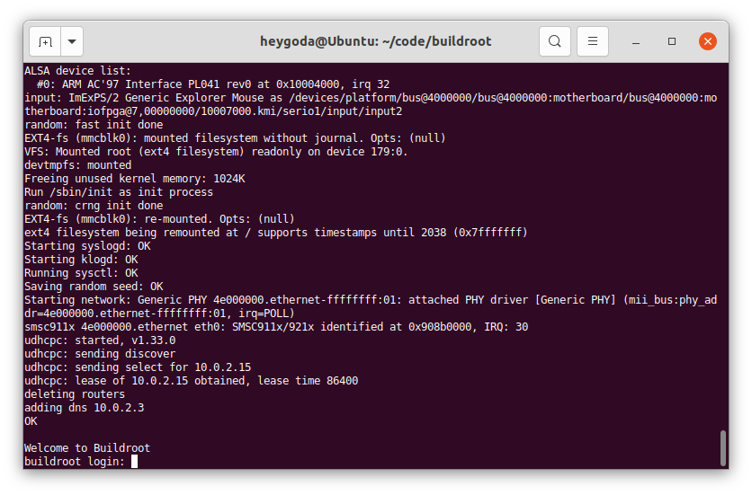
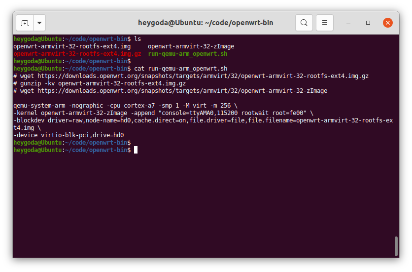

* [概述](#概述)
    * [准备工作](#准备工作)
      * [使用 Buildroot 制作固件](#使用-buildroot-制作固件)
      * [使用 OpenWrt 制作固件](#使用-openwrt-制作固件)
      * [使用 Yocto 制作固件](#使用-yocto-制作固件)
    * [认识和操作嵌入式 Linux 设备](#认识和操作嵌入式-linux-设备)
      * ▣[00_系统初始化](00_系统初始化.md)
      * ▢[01_资源和配置](01_资源和配置.md)
      * ▢[02_硬件设备](02_硬件设备.md)
      * ▢[03_shell脚本](03_shell脚本.md)
      * ▣[04_交叉编译](04_交叉编译.md)
      * ▢[05_网络工具](05_网络工具.md)

## 概述
嵌入式 Linux 设备多种多样，因 Linux 系统内核、驱动、应用等的自由裁剪和组合，导致每种设备上的系统操作方式存在差异，在此总结一些针对嵌入式 Linux 系统的通用操作方法；

### 准备工作

本文档使用 [QEMU](https://www.qemu.org/) 来模拟实际嵌入式设备，QEMU 是一个开源的硬件模拟器和虚拟器，当用作硬件模拟器时，QEMU 可以在一台机器（例如 PC）上运行为另一台机器（例如 ARM 开发板）制作的操作系统和程序；本文档使用 [Buildroot](https://buildroot.org/)、[OpenWrt](https://openwrt.org/)、[Yocto](https://www.yoctoproject.org/) 等构建系统来制作嵌入式 Linux 系统固件，以下在 Ubuntu 20.4 系统中分别说明其制作方法；

> 请先确保 Ubuntu 20.4 系统安装了 ，执行以下命令：
>
> ```shell
> sudo apt install qemu
> ```

#### 使用 Buildroot 制作固件

Buildroot 是一个简单、高效、易用的构建工具，通过交叉编译生成嵌入式 Linux 系统，支持多种嵌入式 Linux 开发板，同时也支持一些 QEMU 板级；以下使用 Buildroot 板级 `qemu_arm_vexpress_defconfig` 来构建固件，对应 qemu 机器 `vexpress-a9`；

安装必要的软件（参考链接： [The Buildroot user manual](https://buildroot.org/downloads/manual/manual.html#requirement)）：

```shell
sudo apt install which sed make binutils build-essential gcc g++ bash patch gzip bzip2 perl tar cpio unzip rsync file bc wget git
```

下载 Buildroot 源码并更新到需要的版本：

```shell
# 使用git下载源码库
# git clone https://git.busybox.net/buildroot
# 镜像下载
git clone https://gitee.com/mirrors/buildroot.git
cd buildroot
git reset --hard 2021.02.2
```

执行默认配置的编译对应板级的固件：

```shell
# cd buildroot
make qemu_arm_vexpress_defconfig
make
```

编译成功后固件在 `output/images/` 目录下，如图：

<div align=center></div>

执行脚本 `output/images/start-qemu.sh serial-only` 以终端方式（无显示屏）运行编译后的固件，如图：

<div align=center></div>

#### 使用 OpenWrt 制作固件

[OpenWrt](https://openwrt.org/) 是一个面向嵌入式设备的 Linux 操作系统，最初是针对路由器设备，拥有强大的网络组件和扩展性，具有良好的模块化和可定制性，现在也常用做其他嵌入式设备的 Linux 发行版；

因 [OpenWrt 源码](https://git.openwrt.org/) 编译时间较长，且编译过程中可能碰到各种各样的问题，为方便起见，在此使用 [官方提供](https://openwrt.org/docs/guide-user/virtualization/qemu) 的 QEMU arm 镜像文件；

下载镜像文件：

```shell
mkdir -p openwrt-bin
cd openwrt-bin
# 下载内核镜像
wget https://downloads.openwrt.org/snapshots/targets/armvirt/32/openwrt-armvirt-32-zImage
# 下载根文件系统镜像并解压
wget https://downloads.openwrt.org/snapshots/targets/armvirt/32/openwrt-armvirt-32-rootfs-ext4.img.gz
gunzip -kv openwrt-armvirt-32-rootfs-ext4.img.gz
```

如图：

<div align=center></div>

使用以下命令运行镜像：

```shell
# run-qemu-arm_openwrt.sh
qemu-system-arm -nographic -cpu cortex-a7 -smp 1 -M virt -m 256 \
-kernel openwrt-armvirt-32-zImage -append "console=ttyAMA0,115200 rootwait root=fe00" \
-blockdev driver=raw,node-name=hd0,cache.direct=on,file.driver=file,file.filename=openwrt-armvirt-32-rootfs-ext4.img \
-device virtio-blk-pci,drive=hd0
```

运行后如图：

<div align=center></div>

#### 使用 Yocto 制作固件

[Yocto](https://www.yoctoproject.org/) 是一个开源协作项目，提供了一些列模板、工具和方法，旨在帮助用户创建自定义的基于 Linux 的系统，可用于任何架构的硬件，例如：嵌入式设备、服务器或虚拟环境等；以下使用 beaglebone-yocto 板级来作演示；

参考链接：[Yocto Project Quick Build — The Yocto Project ® 3.4 documentation](https://docs.yoctoproject.org/brief-yoctoprojectqs/index.html), [4 Using the Quick EMUlator (QEMU) — The Yocto Project ® 3.4 documentation](https://docs.yoctoproject.org/dev-manual/qemu.html)

安装必要的软件：

```shell
sudo apt install gawk wget git diffstat unzip texinfo gcc build-essential chrpath socat cpio python3 python3-pip python3-pexpect xz-utils debianutils iputils-ping python3-git python3-jinja2 libegl1-mesa libsdl1.2-dev pylint3 xterm python3-subunit mesa-common-dev zstd liblz4-tool
```

下载源码并更新到需要的版本：

```shell
# 使用git下载源码库
# git clone git://git.yoctoproject.org/poky
# cd poky
# git reset --hard dunfell-23.0.12
# 若git下载较慢，可直接下载源码包并解压
wget http://downloads.yoctoproject.org/releases/yocto/yocto-3.1.12/poky-dunfell-23.0.12.tar.bz2
tar -xvf poky-dunfell-23.0.12.tar.bz2
```

设置环境变量：

```shell
cd poky-dunfell-23.0.12
source oe-init-build-env
# 执行上一条命令后，终端将进入build目录，下面的内容都以该目录为基础
```

修改编译配置文件 `build/conf/local.conf`，修改板级为 `beaglebone-yocto`，将第 31 行：

```shell
#MACHINE ?= "beaglebone-yocto"
```

改为：

```shell
MACHINE ?= "beaglebone-yocto"
```

启用并行编译并节省磁盘空间，在文件末尾加入：

```shell
INHERIT += "rm_work"
BB_NUMBER_THREADS = "2"
PARALLEL_MAKE = "-j 2"
```

如图：

<div align=center></div>

然后开始编译：

```shell
bitbake -k core-image-minimal
```

编译时间较长，若编译失败，可删除 `sstate-cache`, `cache`, `tmp`目录下的所有文件重新编译，编译成功后的固件在 `tmp/deploy/images/beaglebone-yocto/` 目录下，如图：

<div align=center></div>

修改 QEMU 运行配置文件 `tmp/deploy/images/beaglebone-yocto/core-image-minimal-beaglebone-yocto.qemuboot.conf`，加入选项 `-nographic`，如图：

<div align=center></div>

最后执行以下命令运行编译的镜像：

```
runqemu beaglebone-yocto
```

运行后如图：

<div align=center></div>

### 认识和操作嵌入式 Linux 设备

#### ▣[00_系统初始化](00_系统初始化.md)

#### ▢[01_资源和配置](01_资源和配置.md)

#### ▢[02_硬件设备](02_硬件设备.md)

#### ▢[03_shell脚本](03_shell脚本.md)

#### ▣[04_交叉编译](04_交叉编译.md)

#### ▢[05_网络工具](05_网络工具.md)
