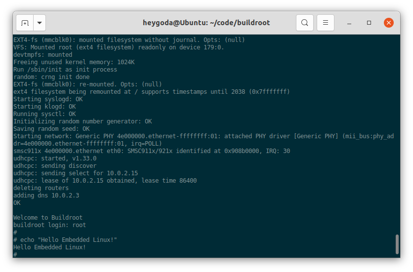

- [命令行 - vi 和 shell](#命令行---vi-和-shell)
  - [概念说明](#概念说明)
  - [常用命令行](#常用命令行)
  - [vi 文本编辑器](#vi-文本编辑器)
  - [shell 脚本语言](#shell-脚本语言)

## 命令行 - vi 和 shell

嵌入式 Linux 系统初始化流程的最后一步，通常是执行终端登录程序，例如：

```shell
ttyAMA0::respawn:/sbin/getty -L  ttyAMA0 0 vt100
```

`/sbin/getty` 是执行登录的程序，它将调用 `/bin/login` 程序进行用户登录，所以也可以是这样：

```
ttyAMA0::respawn:/bin/login
```

输入用户名和密码（如果有的话）后，终端即成为一个交互式 shell 命令行解析器，可以解析、执行用户输入的命令行，并打印命令行输出（如果有的话），如图：

<div align=center></div>

如果不执行登录而直接运行交互式 shell，可以将上面的登录语句改为：

```
ttyAMA0::respawn:/bin/sh
```

如前所述，这些语句需要放在初始化配置文件 `/etc/inittab` 中才能生效；

### 概念说明

**终端（[Terminal](https://en.jinzhao.wiki/wiki/Terminal)）**

在这里指终端模拟软件，如：[PuTTY](https://www.chiark.greenend.org.uk/~sgtatham/putty/), [GNOME Terminal](https://en.jinzhao.wiki/wiki/GNOME_Terminal), [SecureCRT](https://www.vandyke.com/products/securecrt/) 等；其作用是通过串口或网络（Telnet / SSH）等连接其他设备（或作为本机虚拟终端），并模拟计算机终端的行为，使其成为其他设备的输入/输出设备，输入命令 `tty` 可以查询用户登录的串口或[伪终端](https://en.jinzhao.wiki/wiki/Pseudoterminal)，如图：

<div align=center></div>

**Shell**

操作系统的核心部分称为内核 Kernel，主要负责管理硬件资源，并影响来自上层应用程序的系统调用，如图（[Kernel Layout](https://en.jinzhao.wiki/wiki/Kernel_(operating_system)#/media/File:Kernel_Layout.svg)）：

<div align=center></div>

Shell 即是附着在内核上的应用程序，通过图形用户接口（GUI）或命令行接口（CLI），shell将操作系统提供的功能和服务暴露给用户或其它应用程序；在嵌入式 Linux 系统中，通常使用命令行接口（CLI），命令行 Shell 要求用户熟悉命令及其调用语法，并了解相关 Shell 脚本语言（[Shell Command Language](https://pubs.opengroup.org/onlinepubs/9699919799/utilities/V3_chap02.html)）的概念；

系统默认的 Shell 为 `/bin/sh`，在桌面和服务器发行版中，该文件通常指向 [Bash (Unix shell)](https://en.jinzhao.wiki/wiki/Bash_(Unix_shell))，在嵌入式 Linux 中，则是 [Ash ( Almquist Shell )](https://en.jinzhao.wiki/wiki/Almquist_shell)；

> Kernel 和 Shell 是一组相对的概念，例如：Apricot Kernel 杏仁，Sea Shell 海贝壳；

**命令行**

用户通过终端连接 Linux 系统后，输入任何的字符串都将被 Shell 当作命令行来执行，如果不能被识别为命令行，将提示错误，如下图（ `echo "Hello Embedded Linux!"` 为正确的命令行， `hello` 则不是）：

<div align=center></div>

Linux 系统中所有可执行程序都将被当作命令，系统命令通常放在 `/sbin` 或 `/bin` 目录，用户命令通常放在 `/usr/sbin` 或 `/usr/bin` 目录；使用命令时，可以采用路径 + 命令，或者只有命令，如： `/bin/ls` 或 `ls`，这取决于系统的环境变量 `PATH` ，如果该环境变量包含了命令所在目录，则可以不带路径，如图：

<div align=center></div>

嵌入式 Linux 系统中的命令通常使用 [BusyBox](https://busybox.net/) ，Busybox 提供了许多 Unix 常用命令的精简版本，如常用命令 `echo, ls` 等、文本编辑器 [vi](http://ex-vi.sourceforge.net/) 和 shell 脚本解析器 [Ash ( Almquist Shell )](https://en.jinzhao.wiki/wiki/Almquist_shell) 等等，如图所示：

<div align=center></div>

BusyBox 命令的使用方法请 [点击这里](https://busybox.net/downloads/BusyBox.html)，尽管 BusyBox 提供的命令是经过裁剪过的，你也可以通过命令手册来了解其用法，例如：在桌面或服务器发行版上使用 `man [ command-line ]` 来查看手册，或在浏览器查看网页版：[Linux manual pages](https://man7.org/linux/man-pages/dir_all_by_section.html)，此外，简化版手册页  [tldr](https://tldr.sh/)  常用于解命令的常见用法，如图：

<div align=center></div>

### 常用命令行


### vi 文本编辑器


### shell 脚本语言

